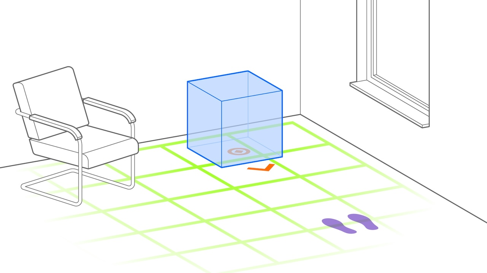
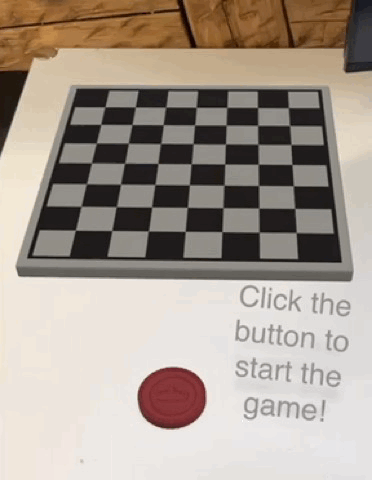

# Ahead Staging

Ahead staging is a technique for presenting 3D content in a way that it is aligned to the spectator’s position and view direction. After the initial staging, users can interact with the virtual scene from their current position or move toward and around the staged content.

* _Use Case_: Spatial Presentation
* _Technology Platform_: [Reality Composer](../README.md)
* _Device Type_: handheld
* _Vision System_: world camera

## Instant Ahead Staging

### AR Patterns

__Behavior Pattern__

* [Instant Reaction](https://github.com/ARpatterns/catalog/blob/main/behavioral-patterns/instant-reaction.md): Immediate execution of the staging ahead action upon detection of the horizontal plane as anchorage point.
  * _Event_: Horizontal plane detection.

__Augmentation Pattern__

* [Ahead Staging](https://github.com/ARpatterns/catalog/blob/main/augmentation-patterns/ahead-staging.md): Presenting the object in front of the user.
  * _Placed_: Initial ahead of the user immediately upon anchor point detection.
  * _Pivot_: Reality Composer objects in the local coordinate system are centered on the anchorage point.

### Diagram

| on:command | &rarr; | do:import to project |
| ---------- | ------ | -------------------- |

> 'metal.ball' ⬇️

| on:click | &rarr; | do:add ahead |
| -------: | ------ | ------------ |

> 'metall.ball' ➕

### Project file

* _Link to project and UDSZ file_: [ProjectExamples](https://github.com/ARpatterns/AppleRealityComposer/tree/main/ProjectExamples/InstantAheadStaging)

## Indirect Ahead Staging

### AR Patterns

__Behavior Pattern__

* [Instant Reaction](https://github.com/ARpatterns/catalog/blob/main/behavioral-patterns/instant-reaction.md): At start of the scene, the chess pieces are hidden.
  * Event: On start
* [Conditional Reaction](https://github.com/ARpatterns/catalog/blob/main/behavioral-patterns/conditional-reaction.md): Upon clicking on the red button, it initiates the ahead staging action that places the chess pieces on the board.
  * _Event_: On tapping

__Augmentation Pattern__

* [Ahead Staging](https://github.com/ARpatterns/catalog/blob/main/augmentation-patterns/ahead-staging.md): Placing objects in front of the user on the platform.
  * _Placed_: Initial ahead of the user on the platform above the anchoring point.

### Diagram

| on:command | &rarr; | do:add |
| ---------- | ------ | ------ |

> 'chessboard' ➕

| on:command | &rarr; | do:add |
| ---------- | ------ | ------ |

> 'red.button' ➕

| on:command | &rarr; | do:add |
| ---------- | ------ | ------ |

> 'text' ➕

| on:start | → | do:hide |
| -------- | -- | ------- |

> 'chess.figures' ➕

| on: button tap | &rarr; | do:add ahead |
| -------------- | ------ | ------------ |

> 'chess.figures' ➕

### Project File

* _Link to project and UDSZ file_: [ProjectExamples](https://github.com/ARpatterns/AppleRealityComposer/tree/main/ProjectExamples/MultipleAheadStaging)
