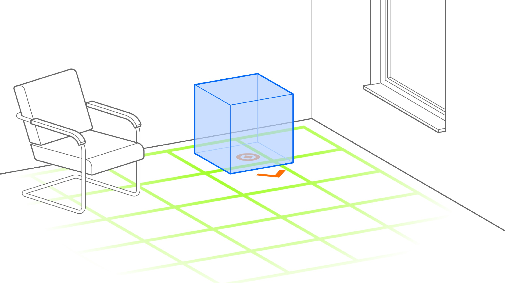

# Ahead Staging

Ahead staging is a technique for presenting 3D content in a way that it is aligned to the spectator’s position and view direction. After the initial staging, users can interact with the virtual scene from their current position or move toward and around the staged content.

* _Use Case_: Spatial Presentation
* _Technology Platform_: [ARchi VR](../README.md)
