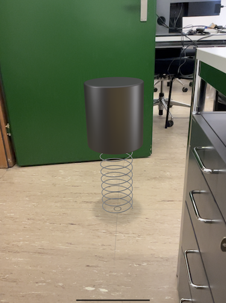
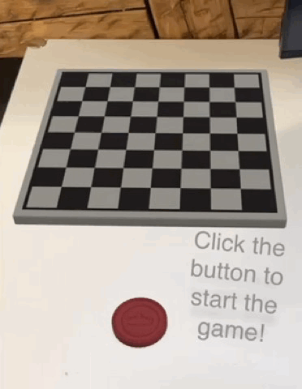

# Ahead Staging

Ahead staging is a technique for presenting 3D content in a way that it is aligned to the spectator’s position and view direction. After the initial staging, users can interact with the virtual scene from their current position or move toward and around the staged content.

* _Use Case_: Spatial Presentation
* _Technology Platform_: [Reality Composer](../README.md)
* _Device Type_: handheld
* _Vision System_: world camera

## Instant Ahead Staging

### AR Patterns

__Behavior Pattern__

* _Event_: on floor detection
* [Instant Reaction](https://github.com/ARpatterns/catalog/blob/main/behavioral-patterns/instant-reaction.md): Immediate execution of the staging ahead action

__Augmentation Pattern__

* [Ahead Staging](https://github.com/ARpatterns/catalog/blob/main/augmentation-patterns/ahead-staging.md): presenting 3D object 1 m  in front of the user.
  * _Placed_: initial ahead of the user on the floor.
  * _Aligned_: initial towards the user in view direction.
  * _Pivot_: Reality Composer objects in the local coordinate system are centered on the ground floor. If the object is rotated around the AR anchor in the world coordinate system, it turns by it's center up axis.

### Project file

* _Link to project and UDSZ file_: [ProjectExamples](https://github.com/ARpatterns/AppleRealityComposer/tree/main/ProjectExamples/InstantAheadStaging)

## Multiple Ahead Staging

### AR Patterns

__Behavior Pattern__

* [Instant Reaction](https://github.com/ARpatterns/catalog/blob/main/behavioral-patterns/instant-reaction.md): Immediate execution of a list of staging ahead actions.
  * _Event_: on floor detection

__Augmentation Patterns__

* [Ahead Staging](https://github.com/ARpatterns/catalog/blob/main/augmentation-patterns/ahead-staging.md): presenting three 3D objects 1 m in front of the user at differnt heights.
  * _Placed_: initial ahead of the user. The first on the floor, the others above it.
  * _Aligned_: initial towards the user in view direction.

### Project File

* _Link to project and UDSZ file_: [ProjectExamples](https://github.com/ARpatterns/AppleRealityComposer/tree/main/ProjectExamples/MultipleAheadStaging)

## Indirect Ahead Staging

### AR Patterns

__Behavior Pattern__

* [Conditional Reaction](https://github.com/ARpatterns/catalog/blob/main/behavioral-patterns/conditional-reaction.md): Upon pressing the red button, it initiates the ahead staging action, arranging the chess pieces on the board.
  * _Event_: on tapping

__Augmentation Pattern__

* [Ahead Staging](https://github.com/ARpatterns/catalog/blob/main/augmentation-patterns/ahead-staging.md): placing virtual 3D objects 1 m in front of the user on the platform.
  * _Placed_: initial ahead of the user on the platform.
  * _Aligned_: initial towards the user in view direction.

### Project File

* _Link to project and UDSZ file_: [ProjectExamples](https://github.com/ARpatterns/AppleRealityComposer/tree/main/ProjectExamples/MultipleAheadStaging)
