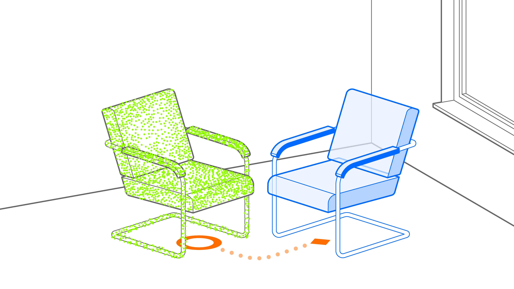
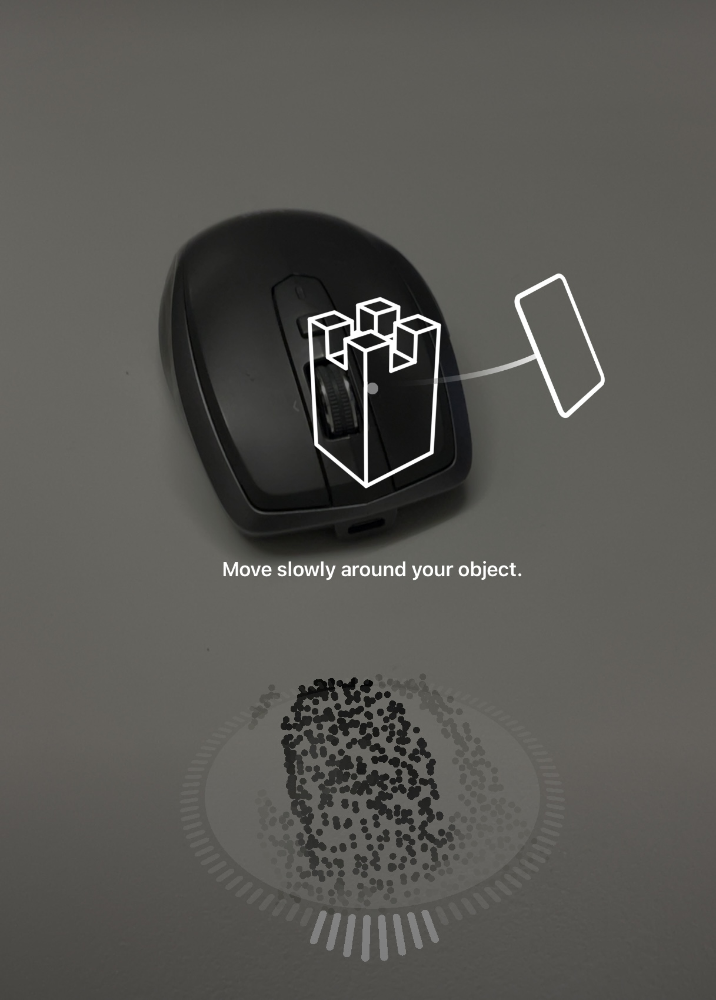
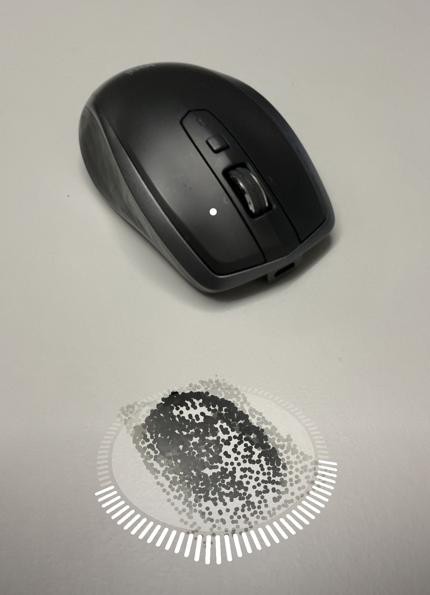
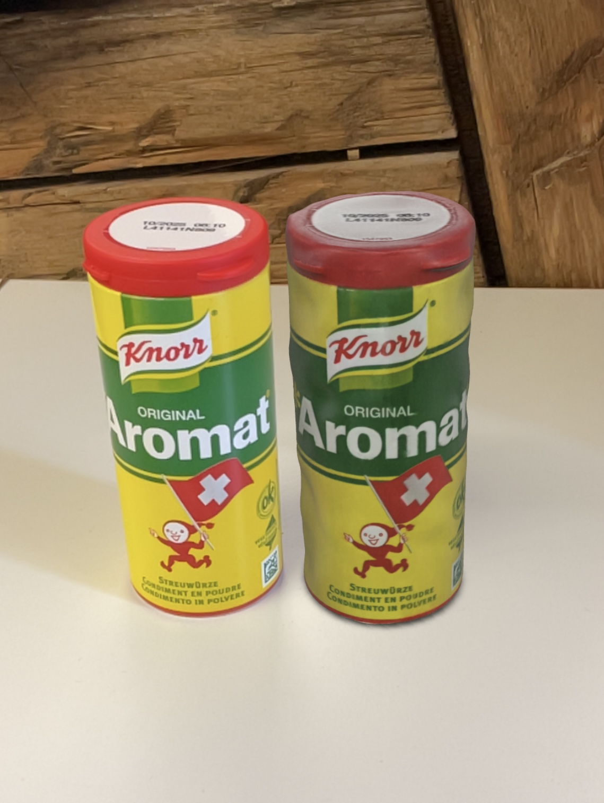
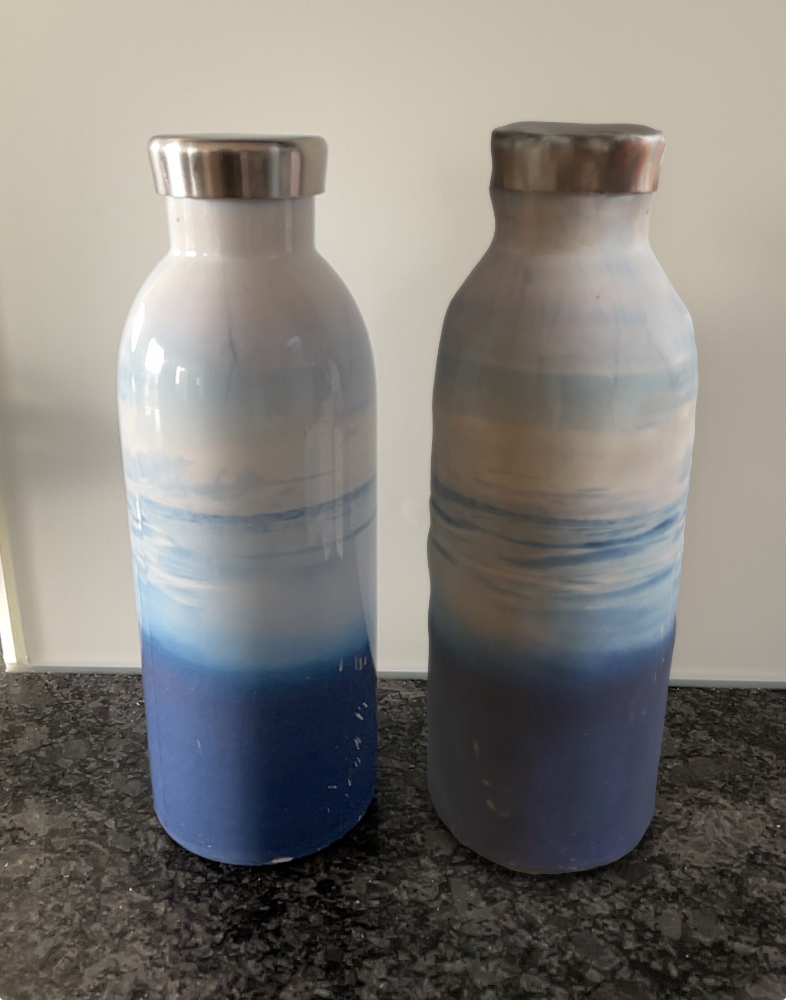

# Capture Twin

A *captured twin* is a digital replica of a physical object, created using data from sensors or cameras. In Reality Composer, this process, known as  *3D Capture*, involves taking multiple images of an object from different angles and using *photogrammetry* to combine them into a 3D model. These models can then be imported into Reality Composer projects, allowing users to interact with them in AR environments.

* _Use Case_: Virtual Object Replica
* _Technology Platform_: [Reality Composer](../README.md)
* _Device Type_: handheld
* _Vision System_: world camera

## 3D Object Capture

Apple's Reality Composer uses the "Object Capture" feature to create realistic 3D models from photographs. To achieve optimal results, position the object in a well-lit environment with even lighting to minimize shadows. Adjust the capture frame to fully enclose the object, then move your device around it slowly to capture images from multiple angles, ensuring complete coverage for photogrammetry.

  

The app processes these images to generate a detailed 3D model, which can be viewed, manipulated, or used in AR. Models can be saved as USDZ files for cross-platform compatibility or reprocessed on a Mac for enhanced quality.

### Captured Twin

Presentation of captured twin next to the original.

### AR Patterns

__Behavior Pattern__

* [Instant Reaction](https://github.com/ARpatterns/catalog/blob/main/behavioral-patterns/instant-reaction.md):

