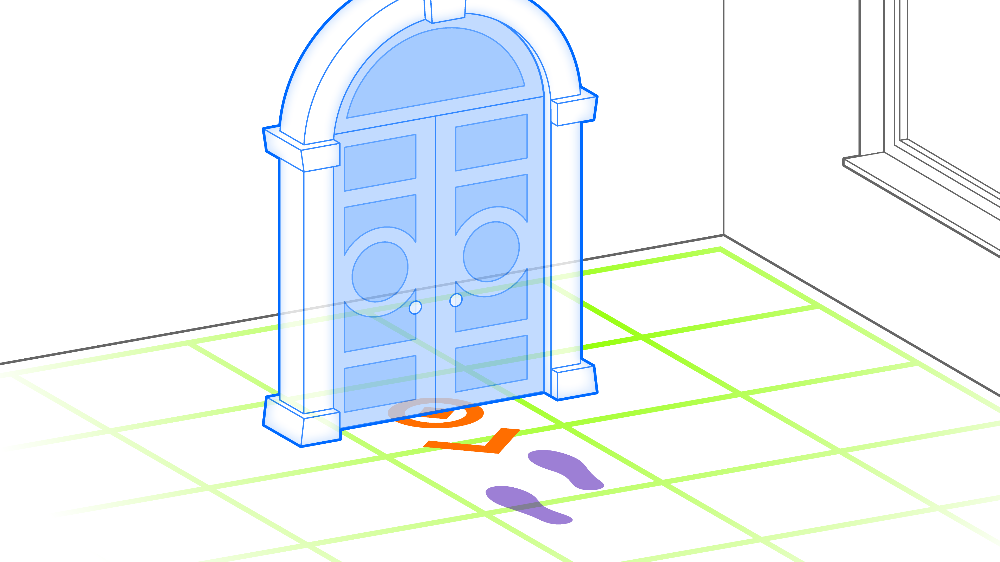
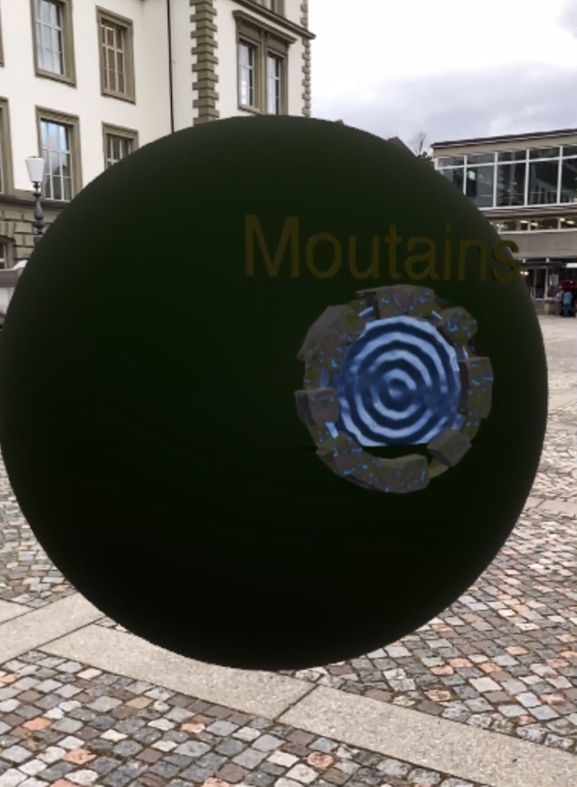

# Pass-through Portal

A pass-trough portal is an augmentation that is initially occluded by a virtual object, which prevents the user from seeing the entire scene. This design is intended to encourage users to engage with the experience by requiring them to pass through a gateway to become fully immersed.

* *Placed* : initially ahead of user
* _Use Case_: Immersive Spatial Exploration
* _Technology Platform_: [Reality Composer](../README.md)
* _Device Type_: Handheld
* _Vision System_: World camera

## Conditional Pass-through Portal

[Demo Video](https://youtube.com/shorts/74fUENXLGZo?feature=share)

### AR Patterns

__Behavior Pattern__

* [Instant Reaction](https://github.com/ARpatterns/catalog/blob/main/behavioral-patterns/instant-reaction.md): Immediate execution of the staging ahead action upon detection of the horizontal floor plane as anchorage point.
  * _Event_: On horizontal plane detection.
* [Conditional Reaction](https://github.com/ARpatterns/catalog/blob/main/behavioral-patterns/conditional-reaction.md): Ensures the inner sphere (360° environment) is occluded until the user walks inside the outer sphere.
  * *Event* : User position crosses the boundary of the outer sphere.
  * *Condition* : User position inside sphere.
  * *Action* : The 360° immersive environment becomes visible to the user once inside.

**Augmentation Pattern**

* [Pass-Through Portal](https://github.com/ARpatterns/catalog/blob/main/augmentation-patterns/pass-through-portal.md): Presentation of a virtual portal and outer sphere that blocks the view of the 360° environment until the user steps through.
  * *Placed* : On anchoring point.
  * *Reaction* : Once the user steps through the portal, they enter the immersive 360° environment.

### Diagram

| on:click | → | do:add |
| -------: | -- | ------ |

> '360_sphere1' ➕
>
> '360_sphere2' ➕

| on:enter | → | do:play |
| -------: | -- | ------- |

> 'entrance_sound'

| on:enter | → | do:reveal |
| -------: | -- | --------- |

> '360_environment'

### Project files

* *Link to project and UDSZ file* :
  * [ProjectExamples](https://github.com/ARpatterns/AppleRealityComposer/tree/main/Pass-throughPortal/ProjectExamples)
  * [MountainSphere](https://sketchfab.com/3d-models/free-skybox-mountain-view-bf36a7600bcb4c3081aafc66197c2278#download)
  * [FantasyWorld](https://sketchfab.com/3d-models/environment-sphere-024bb8ba2eb542dfbda215ee8e83b194#download)
