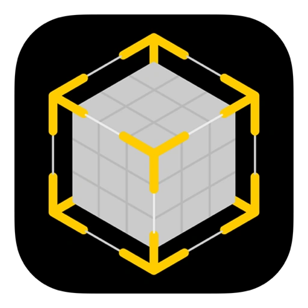
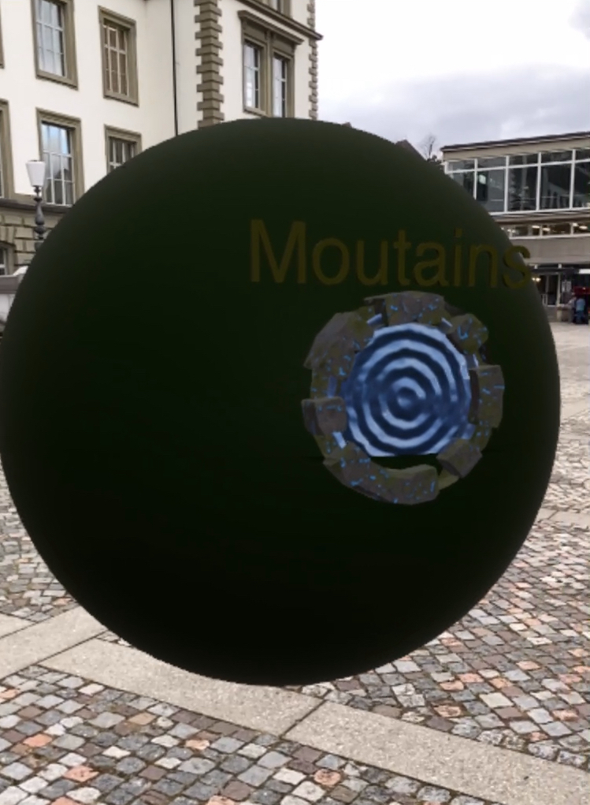

# Apple Reality Composer

## Technology Platform: Apple Reality Composer

- _Software Stack_: Apple Reality Composer
- _Supported Devices_: Handheld iOS devices (iPhones, iPads)
- _Editor Environment_: Apple Reality Composer
- _Development Method_: Visual no-code with drag-and-drop interface

## Reality Composer App

Reality Composer is a no-code AR app available for iPhone and iPad and may be downloaded for free on the Apple App Store. The following scenarios of applied AR Patterns listed below are all provided as Reality Composer projects.

## Basic AR Patterns

### Ahead Staging

Presentation of 3D content ahead of user.

* _Behavioral Patterns_: Instant Reaction or Indirect Reaction
* _Augmentation Patterns_: Ahead Staging
* _Project Link_: [Ahead Staging ](AheadStaging/README.md)

### Anchored Supplement

Presentation of 3D content aligned to detected entity for enhancement.

* _Behavioral Patterns_: Indirect Reaction
* _Augmentation Patterns_: Anchored Supplement
* _Project Link_: [AnchoredSupplement](AnchoredSupplement/README.md)

### Capture Twin

Presentation of captured 3D object as a twin ahead of user.

* _Behavioral Patterns_: Instant Reaction
* _Augmentation Patterns_: Ahead Staging
* _Project Link_: [CaptureTwin](CaptureTwin/README.md)

### Pass-through Portal

Presentation of a pass-through portal with a 360° mountains sphere.

* _Behavioral Patterns_: Instant Reaction and Conditional Reaction
* _Augmentation Patterns_: Pass-Through Portal
* _Project Link_: [Pass-Through Portal](Pass-throughPortal/README.md)
